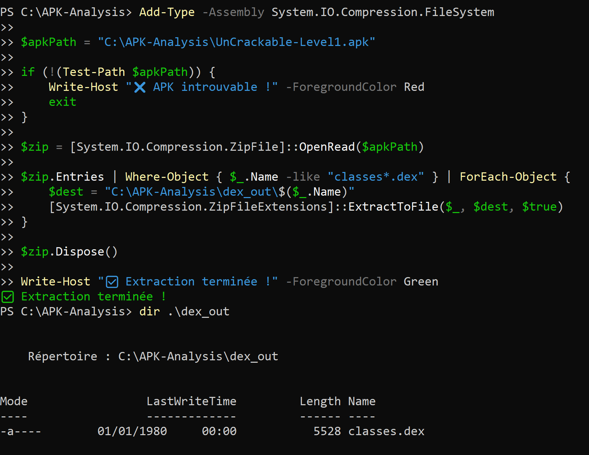
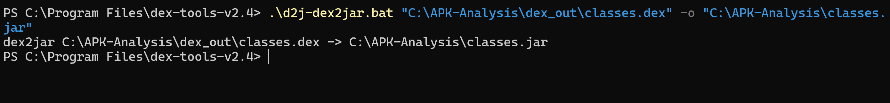
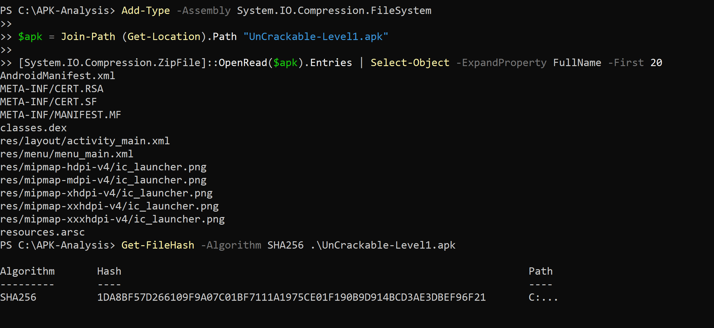
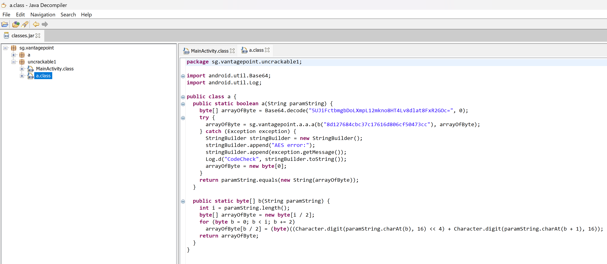
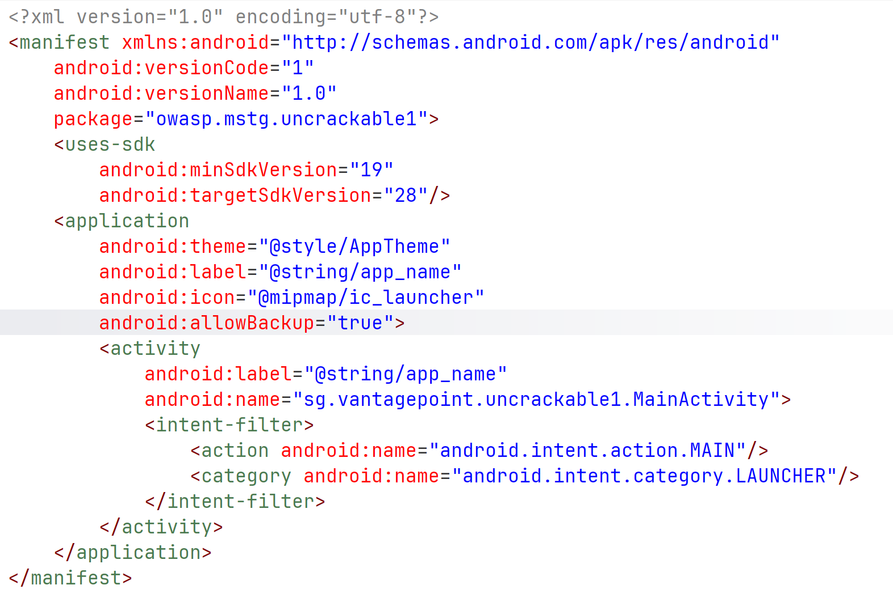
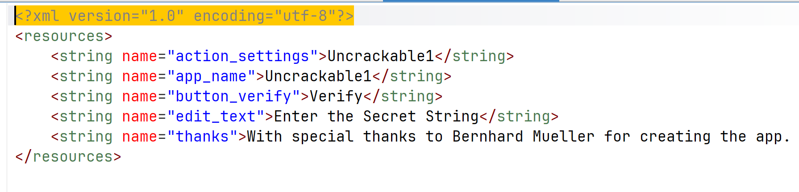
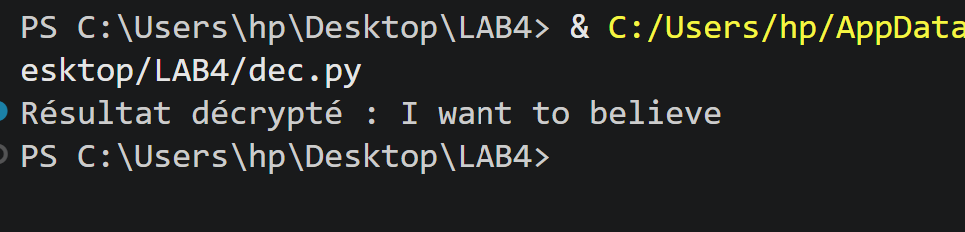

##LAB 4 : Analyse statique d'un APK avec JADX GUI + dex2jar + JD-GUI

## Contexte et Objectif

Ce lab porte sur `UnCrackable-Level1.apk`, une application Android délibérément vulnérable fournie par le projet **OWASP MSTG** (Mobile Security Testing Guide). Elle présente un mécanisme de validation d'un secret qui semble opaque à première vue, mais qui peut être complètement contourné grâce aux techniques de **reverse engineering statique**.

L'objectif est clair : **retrouver la chaîne secrète** que l'application valide en interne, sans avoir accès au code source original.

---

## Environnement & Outils Utilisés

| Outil | Version / Rôle |
|-------|----------------|
| **apktool / unzip** | Extraction du contenu brut de l'APK |
| **dex2jar** | Conversion du bytecode Dalvik (.dex) en archive Java (.jar) |
| **JD-GUI** | Décompilation du .jar en code Java lisible |
| **JADX** | Décompilateur alternatif, plus complet (Manifest + code) |
| **Python 3 + pycryptodome** | Script de déchiffrement AES maison |

---

## Étape 1 — Extraction du Bytecode depuis l'APK

Un fichier `.apk` est en réalité une **archive ZIP** déguisée. Il suffit de le renommer ou d'utiliser un outil comme `apktool` pour en extraire le contenu. L'élément le plus intéressant à ce stade est le fichier `classes.dex` : il contient le **bytecode Dalvik** de toute la logique applicative.



> Le format Dalvik (.dex) est propre à Android. Contrairement au Java bytecode classique (.class), il est conçu pour la machine virtuelle ART/Dalvik et ne peut pas être directement ouvert avec des outils Java standards — d'où la nécessité de le convertir.

---

## Étape 2 — Conversion DEX → JAR avec dex2jar

L'outil **dex2jar** traduit le bytecode Dalvik en bytecode Java standard, encapsulé dans un fichier `.jar`. Cette conversion n'est pas parfaite (certains construits Dalvik n'ont pas d'équivalent Java direct), mais elle est suffisante pour analyser la logique de l'application.



```bash
d2j-dex2jar.sh UnCrackable-Level1.apk -o uncrackable1.jar
```

---

## Étape 3 — Décompilation avec JD-GUI

Une fois le `.jar` obtenu, **JD-GUI** permet de visualiser le code Java reconstruit de façon lisible. C'est à ce stade que la structure des classes de l'application devient accessible.



On identifie rapidement les classes pertinentes :
- `MainActivity` — gère l'interface et la validation de l'entrée utilisateur
- `a` (ou un nom obfusqué) — contient la logique de chiffrement/comparaison

---

## Étape 4 — Analyse du Manifeste avec JADX

En parallèle, l'outil **JADX** offre une vue plus complète incluant le fichier `AndroidManifest.xml`. Ce fichier est fondamental car il révèle l'architecture de l'application.



**Points clés identifiés :**
- **Package :** `owasp.mstg.uncrackable1`
- **Activité principale :** `sg.vantagepoint.uncrackable1.MainActivity`
- **SDK minimum :** API 14 — la compatibilité large est souvent signe d'une moindre surface de protection moderne

---

## Étape 5 — Inspection des Ressources et Recherche de Chaînes

Avant même d'entrer dans le code Java, une bonne pratique est d'inspecter les ressources statiques (fichiers `res/values/strings.xml`, etc.) et d'exécuter l'utilitaire `strings` sur le binaire brut pour trouver des données en clair.




Cette étape révèle plusieurs éléments suspects :
- Une longue chaîne encodée en **Base64**
- Ce qui ressemble à une **clé hexadécimale**

Ces deux éléments sont des indices directs vers le mécanisme de chiffrement.

---

## Étape 6 — Identification du Mécanisme de Chiffrement (AES-ECB)

L'analyse du code décompilé dans JD-GUI confirme l'hypothèse : l'application utilise **AES en mode ECB** (Electronic Codebook) pour chiffrer le secret et le comparer à l'entrée de l'utilisateur.


**Extrait du code décompilé :**

```java
public static boolean verify(String input) {
    byte[] key = hexStringToByteArray("8d127684cbc37c17616d806cf50473cc");
    byte[] ciphertext = Base64.decode("5UJiFctbmgbDoLXmpL12mkno8HT4Lv8dlat8FxR2GOc=", 0);
    // Comparaison avec AES-ECB
    return Arrays.equals(ciphertext, encrypt(key, input.getBytes()));
}
```

**Pourquoi AES-ECB est dangereux ici ?**

Le mode ECB est **déterministe** : le même bloc en clair produit toujours le même bloc chiffré. Cela permet une attaque par dictionnaire ou, comme ici, un simple déchiffrement si l'on dispose de la clé — stockée en dur dans le code.

> ⚠️ Stocker une clé cryptographique directement dans le code source est une **mauvaise pratique critique** (CWE-321). Toute personne ayant accès à l'APK peut la récupérer.

---

## Étape 7 — Script de Déchiffrement Python

Avec la clé et le texte chiffré identifiés, j'ai rédigé un script Python utilisant la bibliothèque `pycryptodome` pour déchiffrer le secret :

```python
from Crypto.Cipher import AES
import base64

def decrypt_secret():
    # Clé AES 128 bits extraite du code Java (stockée en dur — mauvaise pratique)
    key_hex = "8d127684cbc37c17616d806cf50473cc"
    key = bytes.fromhex(key_hex)

    # Texte chiffré encodé en Base64, extrait des ressources de l'APK
    data_b64 = "5UJiFctbmgbDoLXmpL12mkno8HT4Lv8dlat8FxR2GOc="
    ciphertext = base64.b64decode(data_b64)

    # Déchiffrement AES en mode ECB (sans IV — caractéristique du mode ECB)
    cipher = AES.new(key, AES.MODE_ECB)
    decrypted = cipher.decrypt(ciphertext)

    # Suppression du padding PKCS#7
    # Le dernier octet indique le nombre d'octets de padding ajoutés
    padding_len = decrypted[-1]
    secret = decrypted[:-padding_len].decode('utf-8')

    print(f"[+] Secret déchiffré : {secret}")

if __name__ == "__main__":
    decrypt_secret()
```

**Détails techniques importants :**

| Élément | Valeur / Explication |
|---------|---------------------|
| Algorithme | AES (Advanced Encryption Standard) |
| Taille de la clé | 128 bits (16 octets) |
| Mode opératoire | ECB — pas d'IV, traitement bloc par bloc indépendant |
| Encodage du ciphertext | Base64 (transport safe pour les données binaires) |
| Padding | PKCS#7 — le dernier octet = nombre d'octets de padding |

---

## Étape 8 — Résultat Final

En exécutant le script :

```bash
python dec.py
```



Le secret est affiché en clair. En le saisissant dans l'interface de l'application, le message de succès s'affiche.

---

## Récapitulatif de la Démarche

```
APK
 └─► Extraction (unzip/apktool)
      └─► classes.dex
           └─► dex2jar → .jar
                └─► JD-GUI / JADX → Code Java
                     └─► Identification : clé AES + ciphertext Base64
                          └─► Script Python (AES-ECB decrypt)
                               └─► Secret en clair ✓
```

---

## Concepts de Sécurité Abordés

### 1. Décompilation d'APK Android
Les applications Android ne sont **pas sécurisées par obscurité**. Le bytecode Dalvik est facilement convertible et décompilable. Sans obfuscation (ProGuard/R8), la logique interne est transparente.

### 2. AES-ECB : Un Mode à Éviter en Production
Le mode ECB ne fournit **aucune diffusion** : des blocs identiques en clair produisent des blocs identiques en chiffré. En pratique, on préfère :
- **AES-CBC** avec IV aléatoire pour les données à longueur fixe
- **AES-GCM** pour un chiffrement authentifié (intégrité + confidentialité)

### 3. Hardcoded Secrets (CWE-321)
Toute clé, token ou secret intégré directement dans le code est récupérable par reverse engineering. Les alternatives sécurisées incluent :
- Android **Keystore System** pour stocker les clés de façon sécurisée
- Dérivation de clé dynamique (ex: PBKDF2) à partir de données non statiques

---

## Recommandations de Mitigation

| Vulnérabilité | Recommandation |
|---------------|----------------|
| Clé AES en dur dans le code | Utiliser Android Keystore ou dériver la clé dynamiquement |
| Mode AES-ECB | Remplacer par AES-GCM (chiffrement authentifié) |
| Code non obfusqué | Activer ProGuard/R8 dans le build Gradle |
| Pas de détection de root | Implémenter des vérifications d'intégrité (SafetyNet/Play Integrity) |
| Validation locale uniquement | Déplacer la validation côté serveur si possible |

---

**Statut :** ✅ Challenge complété  
**Niveau de difficulté :** Débutant — Introduction aux fondamentaux du reverse engineering Android  
**Compétences acquises :** Analyse statique d'APK, déchiffrement AES, identification de vulnérabilités cryptographiques


## Realise par 
NAFTAOUI Niama
